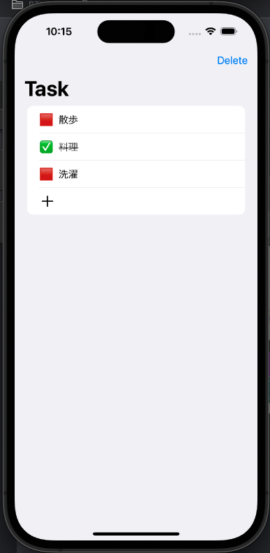

# swift_soro_swiftUI

# メモアプリ「ver.1_swiftUI」　



---

### 【使用システム】

<div>


</div>

<hr>

## 🎤 システム概要

簡単なメモ帳です

## 🎤 機能

- [ ] 背景色を変更
- [x] メモの記入
- [ ] 編集
- [ ] データ保存

## 🎤 使用環境

- macOS
- Xcode

## 🎤 インストール

```
$ git clone https://github.com/〜〜 //クローンする
$ cd 〜〜 //クローンしたディレクトリに移動する
```

## 🎤 使い方

1. 「＋」：メモ内容を追加できます
2. 「タスクを選択」：🟥 未実施から ✅ 実施済みに変更
3. 「delete」：実施済みの内容を削除

## 🎤 作者

- 萩 巧実
- swiftUI の方がコードが直感的でわかりやすい気がする
- GUI（画面操作）上でセットできないのでコードの理解が必要
- @State などで明示的に役割を付与するのでわかりやすい（バグも少ない？？）
- コードベースなのでコード数が少ないと思う
